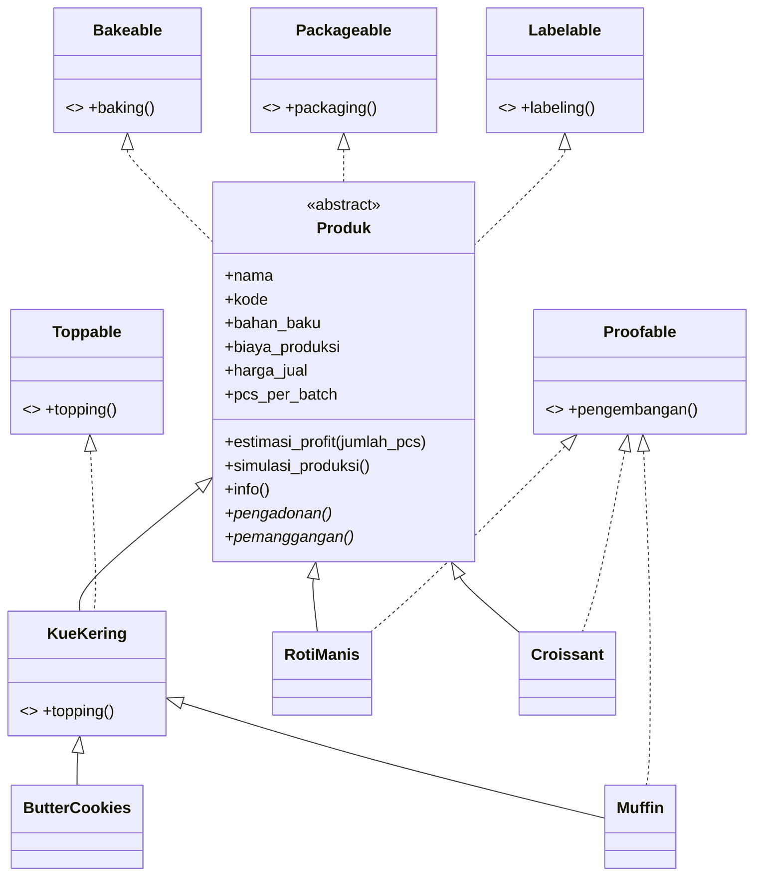

# Diagram Class (UML) - Hanari Bakery

Tempel kode mermaid berikut di https://mermaid.live atau gambar ulang di draw.io / Diagram.io.

```mermaid
classDiagram
    class Produk {
        <<abstract>>
        +nama
        +kode
        +bahan_baku
        +biaya_produksi
        +harga_jual
        +pcs_per_batch
        +estimasi_profit(jumlah_pcs)
        +simulasi_produksi()
        +info()
        +pengadonan()*
        +pemanggangan()*
    }
    class Bakeable { <<interface>> +baking() }
    class Packageable { <<interface>> +packaging() }
    class Labelable { <<interface>> +labeling() }
    class Proofable { <<interface>> +pengembangan() }
    class Toppable { <<interface>> +topping() }
    class KueKering { <<abstract>> +topping() }
    class RotiManis
    class Croissant
    class ButterCookies
    class Muffin

    Bakeable <|.. Produk
    Packageable <|.. Produk
    Labelable <|.. Produk
    Produk <|-- RotiManis
    Produk <|-- Croissant
    Produk <|-- KueKering
    Toppable <|.. KueKering
    KueKering <|-- ButterCookies
    KueKering <|-- Muffin
    Proofable <|.. RotiManis
    Proofable <|.. Croissant
    Proofable <|.. Muffin
```
